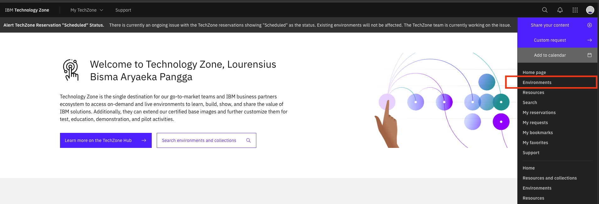
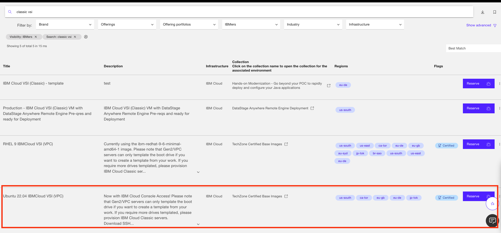
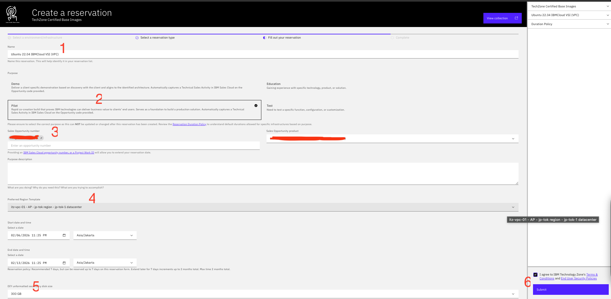
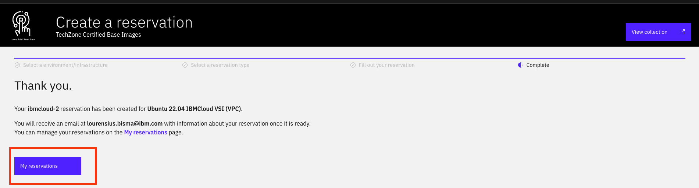

# Reserve VM in Techzone

This guide explains how to reserve a Virtual Machine (VM) in IBM Techzone step by step.

---

## Step 1: Access Techzone Environment

1. Go to Techzone URL: https://techzone.ibm.com/home  
2. Click **Applications** icon  
3. Click **Environment**

---

## Step 2: Select Environment Template

1. In the search field, type **classic vsi**  
2. Select the latest and valid environment  
   - Example: **Ubuntu 22.04 IBMCloud VSI (VPC)**
3. Click **Reserve** button

---

## Step 3: Fill Required Information

Fill in the required fields as follows:

### 3.1 Environment Name  
Give your environment a meaningful name.

### 3.2 Reservation Purpose  
Select the purpose of your reservation:
- **Demo** or **Pilot** (if you have an Opportunity ID)
- **Education** (if you do not have an Opportunity ID)

### 3.3 Opportunity ID  
Fill in your Opportunity ID (if available).

### 3.4 Region  
Select the region where your environment will be provisioned.  
- Example: **AP**

### 3.5 Storage Size  
Select the storage size.  
- Example: **300 GB**

### 3.6 Submit  
Click the **Submit** button to start provisioning.

---

## Step 4: Monitor Provisioning Status

Your environment is now being provisioned.

You can:
- Wait until provisioning completes, or
- Click **My Reservation** to check the provisioning status

---

## Done 🎉

Once provisioning is complete, your VM environment is ready to use.
