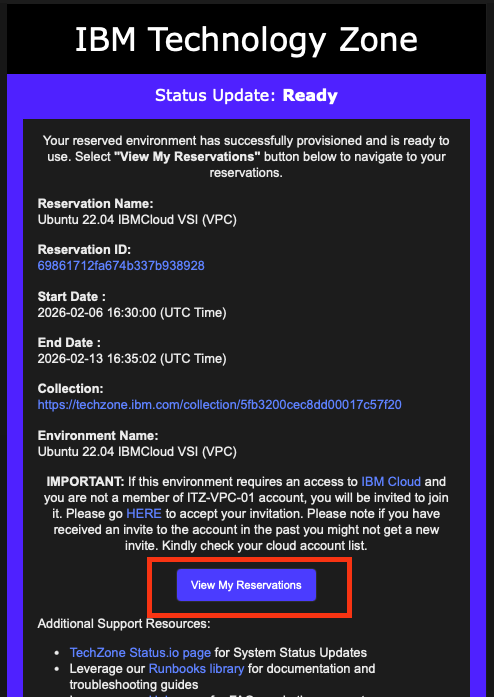
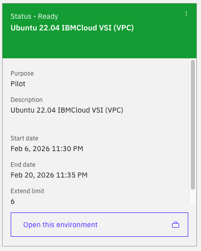
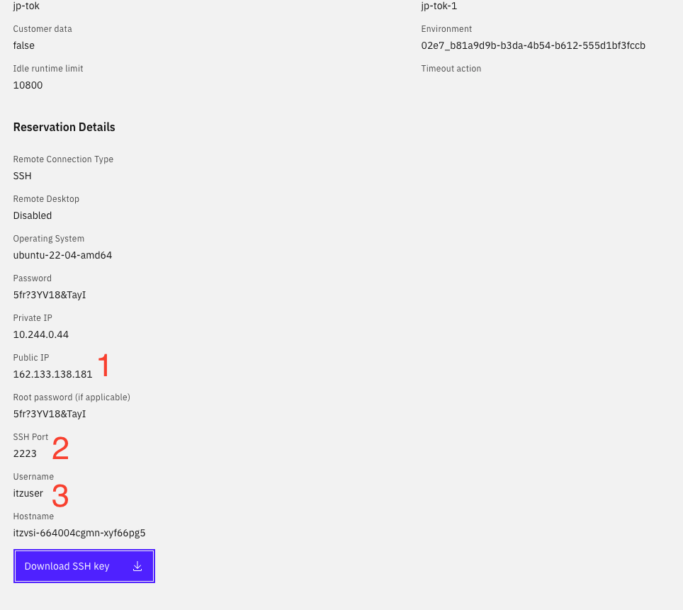
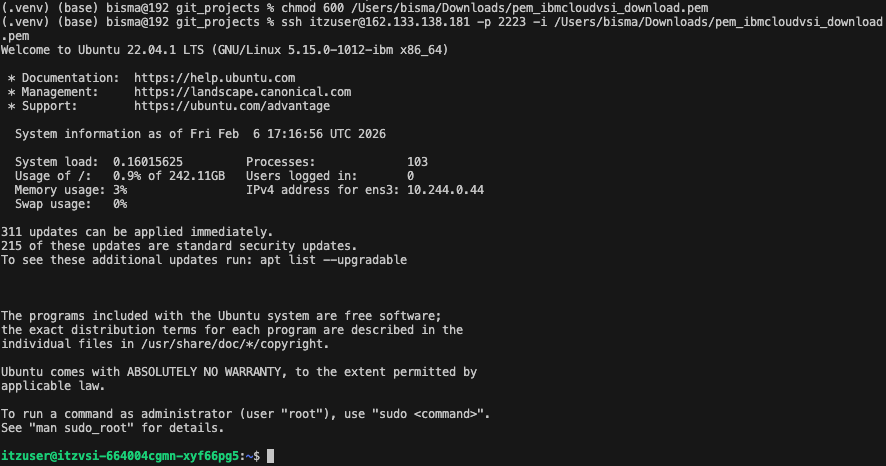

# Access Techzone

This guide explains how to access your VM environment in Techzone.

---

## Step by Step

### 1. Open Reservation Email
Once the environment has been provisioned, you will receive an email.

- Open the email
- Click **View My Reservations**



---

### 2. Select the Provisioned Environment
- Click the environment that you have provisioned



---

### 3. Collect VM Access Information
- Scroll to the bottom of the page
- Copy and save the following information into your local file:
  1. Public IP  
  2. SSH Port  
  3. Username
- Click **Download SSH Key** (this key will be used to access the VM)



---

### 4. Access the VM via Terminal
Open a terminal on your local device.

If you are using **macOS**, make the SSH key private:

```
chmod 600 <path to your downloaded SSH key>
```

Connect to the VM:

```
ssh <username>@<public ip> -p <SSH port> -i <path to your downloaded SSH key>
```

- Type `yes` when prompted
- You are now connected to the VM



---

## Done 🎉
