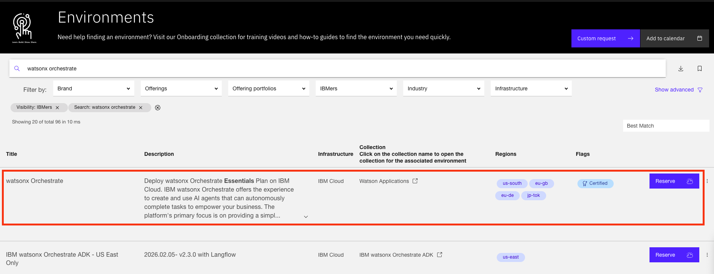
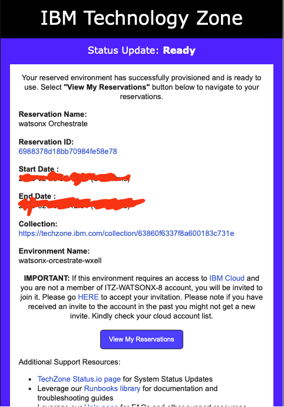
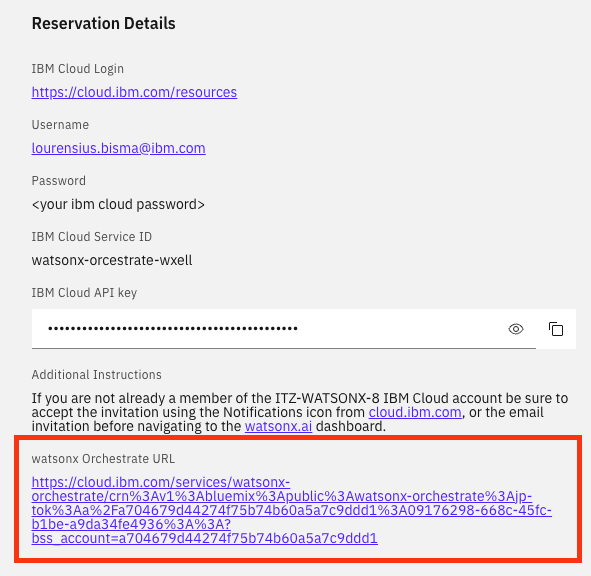
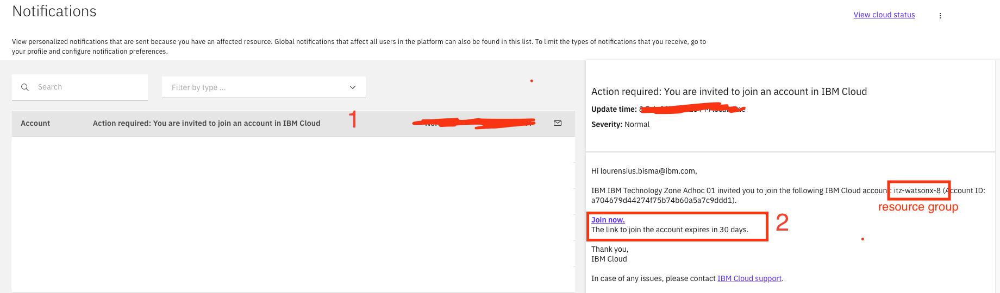
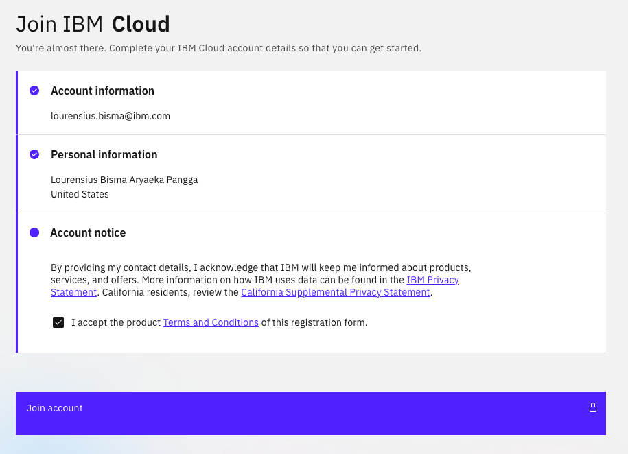
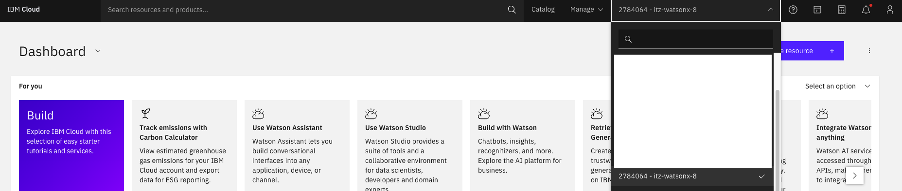
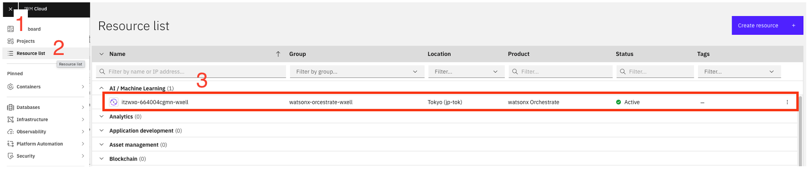
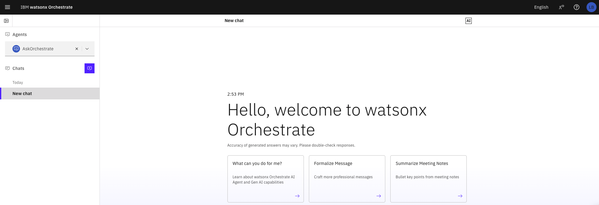
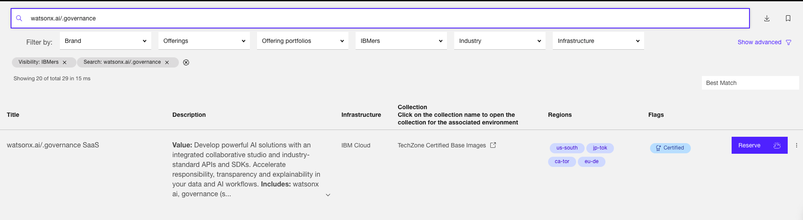
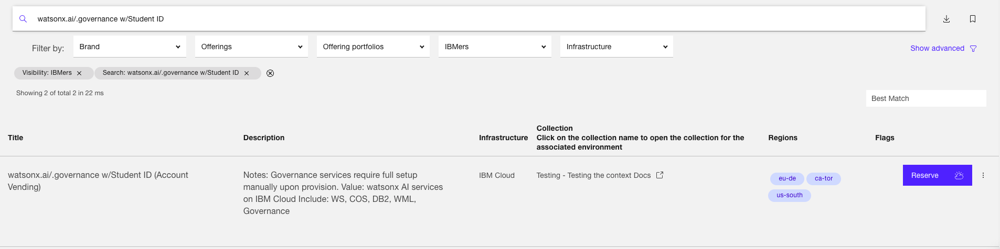

# Reserve watsonx Orchestrate Environment in Techzone

This guide walks you through the steps to reserve a **watsonx Orchestrate** environment using **IBM Techzone**.

---

## Step-by-step Guide

### 1. Open Environment Page and Search
Open the Techzone Environment page:  
https://techzone.ibm.com/environments?VisibilityFilter=%5B%22IBMers%22%5D  

- Type **"watsonx Orchestrate"** in the search field  
- Select the **latest available environment**

---

### 2. Request the Environment
- Click **Request an Environment** to open the reservation menu  
- Fill in the required information:
  1. **Reservation name**
  2. **Purpose type**  
     - Select **Pilot/Demo** if available  
     - Otherwise, select **Education**
  3. **Opportunity number** (if you have one)
  4. **Region**
- Click **Submit**

---

### 3. Check Provisioning Status
Your environment will start provisioning.

- Click **My Reservations** to view the status

---

### 4. Access the Ready Environment
Once provisioning is complete:
- You will receive an **email notification**
- Click **View My Reservation**
- Enter your reserved environment

---

### 5. Open watsonx Orchestrate URL
- Scroll down in the reservation details
- Find the **watsonx Orchestrate URL**
- Click the URL to redirect to **IBM Cloud**

---

### 6. Join IBM Cloud Account
- Go to the Notifications page:  
  https://cloud.ibm.com/notifications
- Select the **latest notification**
- Click the **"Join now"** link
- Take note of the **Resource Group**  
  - Example: `itz-watsonx-8`

---

### 7. Verify Your Identity
- Follow all steps to verify your identity
- On the final step, click **Join account**

---

### 8. Confirm Resource Group
- You should now be inside your new **Resource Group**
- Click the **Resource Group dropdown**
- Ensure the correct group is selected

---

### 9. Open watsonx Orchestrate from Resource List
- Click the **Navigation Menu** (top-left)
- Select **Resource list**
- Expand **AI / Machine Learning**
- Click **watsonx Orchestrate**

---

### 10. Access watsonx Orchestrate Homepage
- Click the **watsonx Orchestrate** instance
- You are now on the **watsonx Orchestrate homepage** 🎉

### 11. Save watsonx Orchestrate credentials
- You also need to store watsonx Orchestrate **APIKEY** and **Instance URL**
- To do this, go to your watsonx Orchestrate instance page in IBM Cloud
- Put it somewhere in your local because you will use it in next sessions

---

You’re all set! 🚀

## Additional reservation (watsonx.ai))

### Reserve watsonx.ai for trainers

Use "watsonx.ai/.governance SaaS" as your main watsonx.ai environment. Once your watsonx.ai environment is ready you also must follow steps similar to what you have done with watsonx Orchestrate.

### Reserve watsonx.ai environment for participants

There is also a case where you must provide environment for the participants. For this case you use "watsonx.ai/.governance w/Student ID" in Techzone environment. Once it is ready, you will be receiving URL, username and password that can be used for the participants. The environment is optimal for 1 participant, so if you have 10 participants it is recommended to reserve 10 environments.

