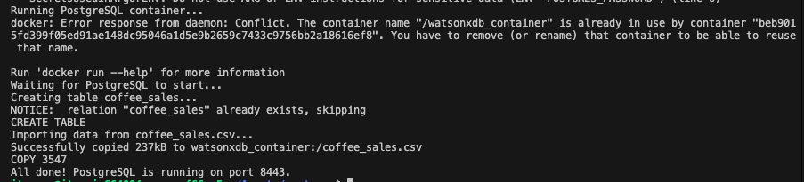

# Deploy PostgreSQL

This guide explains how to deploy postgreSQL inside VM.

---

Run the following commands on the VM:

```
git clone https://github.com/Client-Engineering-Indonesia/Incubation-Agentic-AI-2026

cd Incubation-Agentic-AI-2026/Assets/postgres/
chmod +x init-db.sh
./init-db.sh
```



---

## Done 🎉

Now PostgreSQL is accessible through public network.