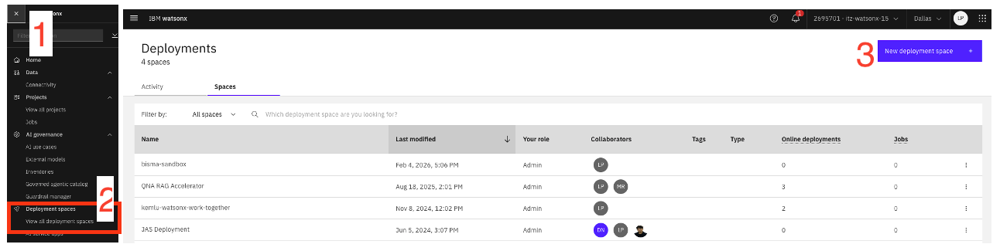
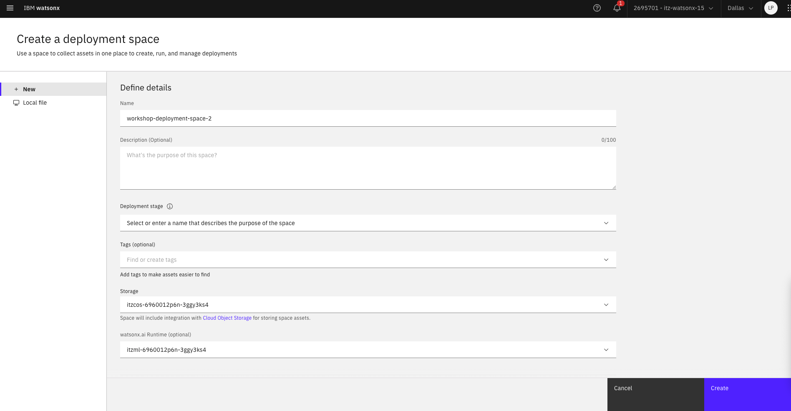

# Create Deployment Space in watsonx.ai

This guide walks you through the steps to create a **Deployment Space** in **watsonx.ai**, which is required to deploy models, AI services, or agents.

---

## Prerequisites

- An active IBM Cloud account  
- Access to an existing watsonx.ai project  

---

## Step-by-Step Guide

### Step 1: Open watsonx.ai

1. Go to the watsonx.ai console.
2. Log in using your IBM Cloud credentials.

---

### Step 2: Navigate to Deployment Spaces

1. From the left navigation menu, click **Deployment spaces**.
2. Click **New deployment space**.

---

### Step 3: Configure Deployment Space Details

1. Enter a **Deployment space name**.
2. (Optional) Add a **description**.
3. Choose the **Cloud Object Storage** instance.
4. Choose the **watsonx.ai runtime** instance.

---

## Notes

- Ensure you have sufficient permissions to create deployment spaces.
- One deployment space can be used across multiple deployments.

---

Happy deploying 🚀
