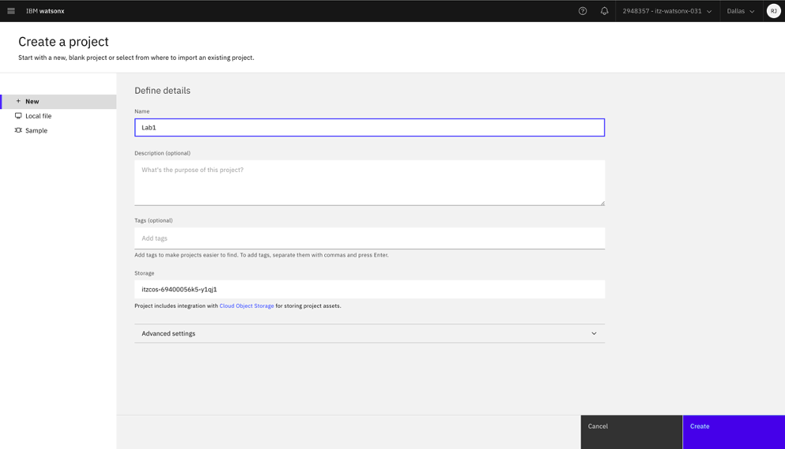
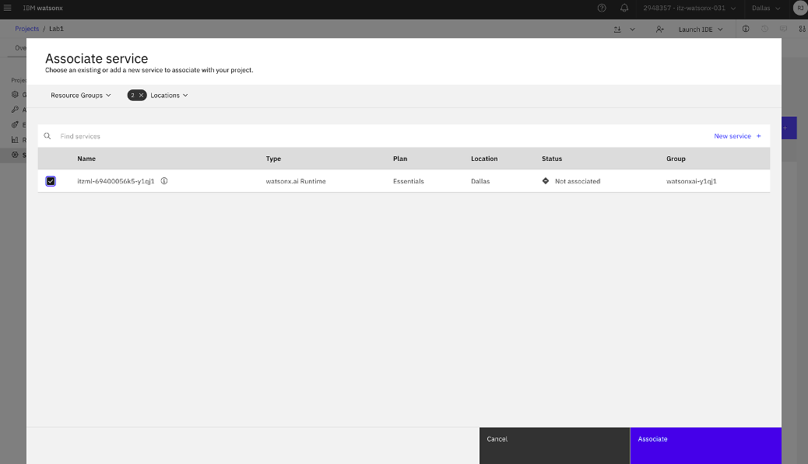
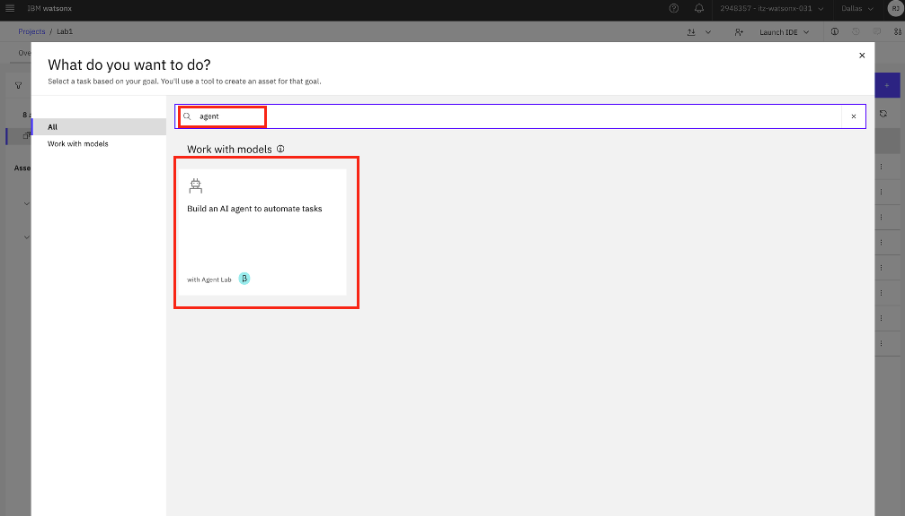
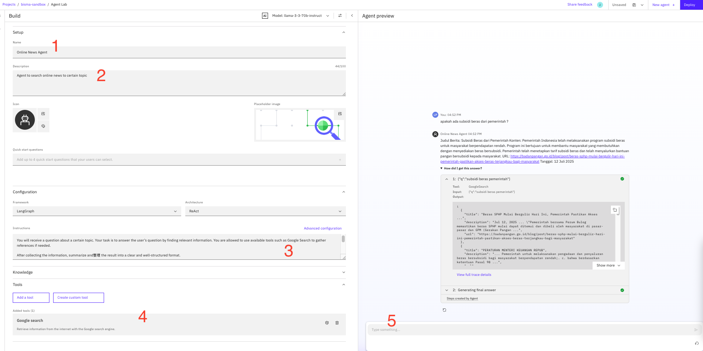
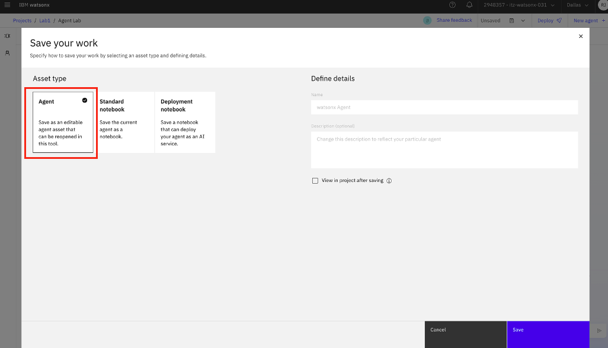
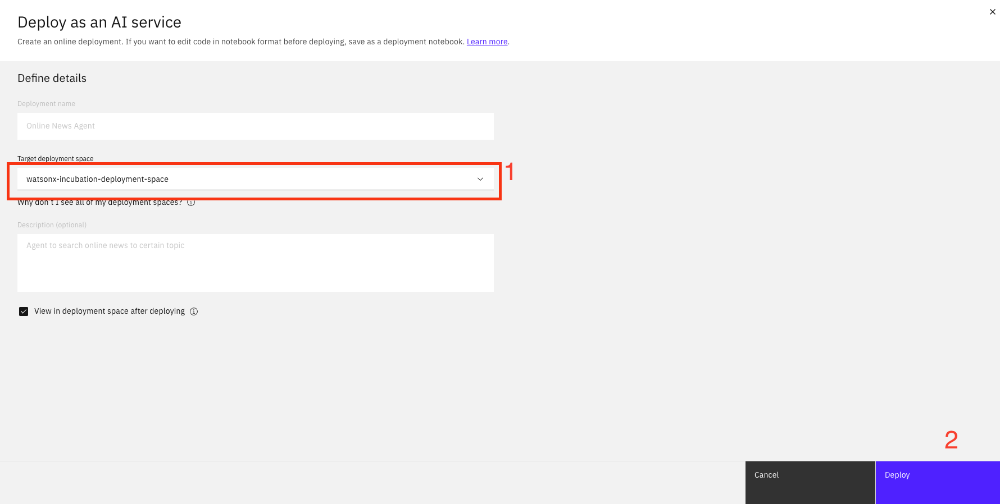
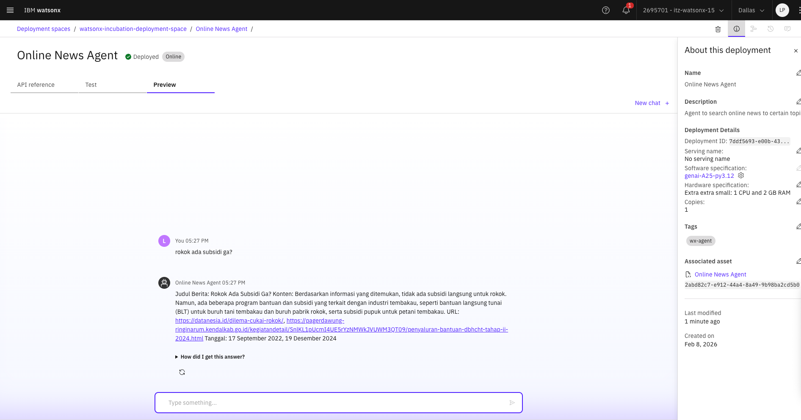

# Develop AI Agent in watsonx.ai

---

## Setup watsonx.ai Project

### Step 1: Create Project

If this is your first time using this account, you'll need to create a project before using Agent Lab. Alternatively, you can use an existing project.



---

### Step 2: Associate watsonx.ai with the watsonx.ai Runtime

After creating a project, associate it with the watsonx.ai Runtime service.

- Go to **Manage → Services & Integrations → Associate Service**
- Select **watsonx.ai** and associate it with the existing project



---

## Create AI Agent Using AgentLab

### Step 1: Create an AI Agent

- Go to **Assets** tab in your project  
- Click **New Asset** on the left side  
- Search for **"Build an AI Agent to Automate Tasks"**  
- Click **Build an AI agent to automate tasks**



---

### Step 2: Name and Add Details to the Agent

#### 2.1 Name the Agent
- Click **Build an AI Agent to Automate Tasks**
- Enter the agent name you want to create

#### 2.2 Add Agent Details

Fill in the agent configuration as below:

1. **Agent Name**: `Online News Agent`  
2. **Description**: `Agent to search online news to certain topic`  
3. **Prompt**:

```
You are an intelligent assistant.

You will receive a question about a certain topic. Your task is to answer the user’s question by finding relevant information. You are allowed to use available tools such as Google Search to gather references if needed.

After collecting the information, summarize and reformat the result into a clear and well-structured format.

Output format (mandatory):

## Judul Berita: <Judul berita>
## Konten: <Penjelasan atau ringkasan isi berita>
## URL: <Tautan sumber berita>
## Tanggal: <Tanggal publikasi berita, jika tersedia>

Rules:

Gunakan Bahasa Indonesia untuk seluruh jawaban.

Jawaban harus ringkas, faktual, dan mudah dibaca.

Jika informasi tertentu tidak tersedia, boleh dikosongkan atau dihilangkan.

Jangan menambahkan penjelasan di luar format yang sudah ditentukan.
```

4. Ensure **Google Search** tool is added in the **Tools** section  
5. In **Agent Preview**, type:  
   `apakah ada subsidi beras dari pemerintah?`  
   then press **Enter**  
6. If the configuration is correct, you will see the expected structured output



---

## Deploy Agent

### Step 1: Save Agent

- Click **Save As**


- Select **Agent**
- Click **Save**



---

### Step 2: Deploy Agent

- Click **Deploy** button at the top-right  
- Select the deployment space you created in **Lab 0**  
- Click **Deploy**



- Go to your **Deployment Space**
- Click **Deployment** tab
- Select the latest deployed Agent
- Go to **Preview** tab
- Type:  
  `rokok ada subsidi ga?`  
  then press **Enter**

If the agent returns a proper response, your AI Agent has been successfully deployed 🎉

