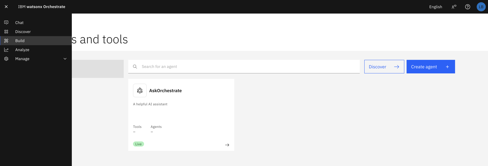
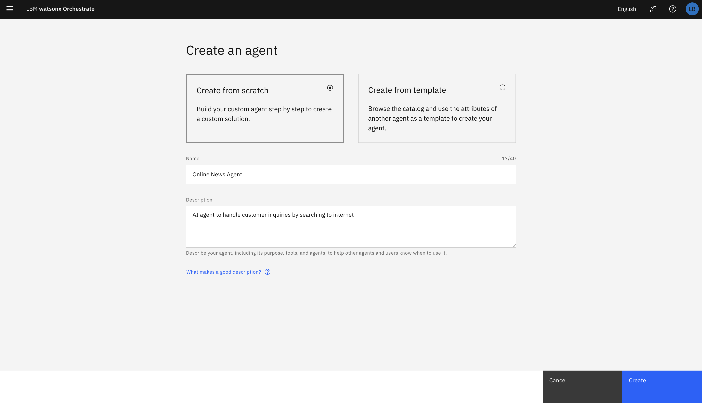
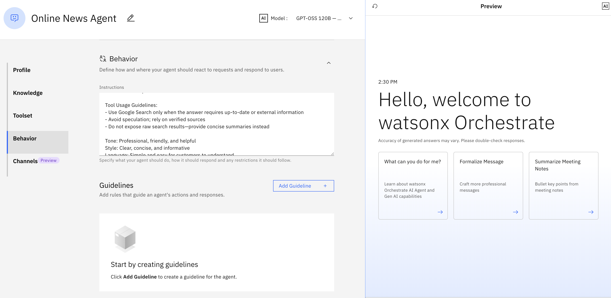
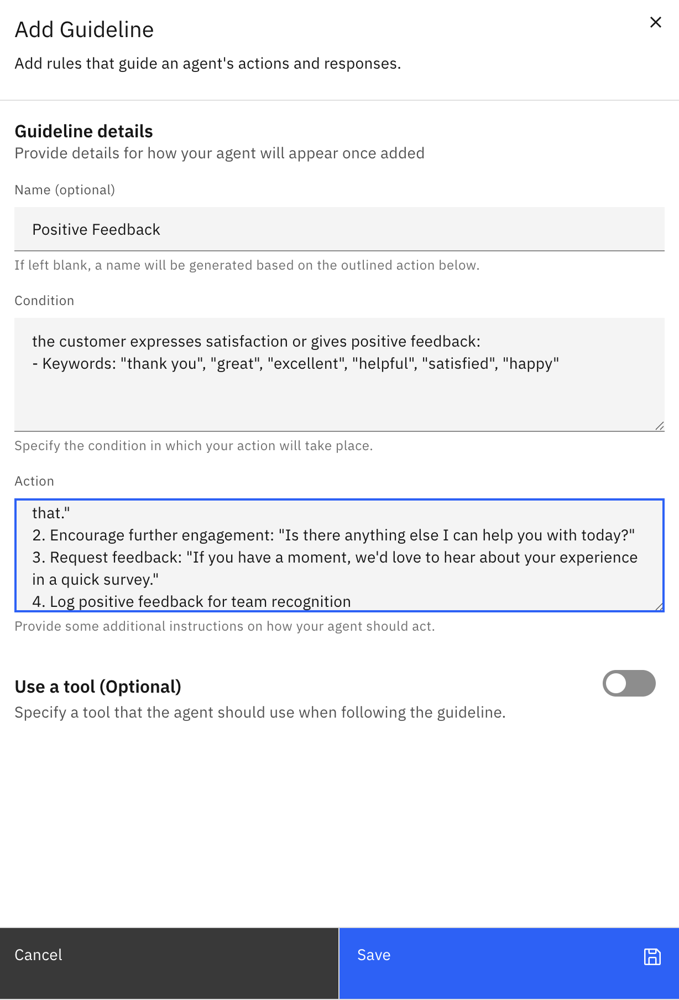

# Module 1.1: Creating Basic Agent

---

## Overview

In this module, you'll learn how to build conversational agents from scratch in watsonx Orchestrate. You'll configure agent behavior, add responses, and implement conditional logic using IF-THEN guidelines.

**Duration:** ~30 minutes

**Learning Objectives:**
- Create a new agent in watsonx Orchestrate
- Configure agent behavior and personality
- Add conversational responses
- Implement IF-THEN conditional guidelines
- Test and validate agent responses

---

## Prerequisites

Before starting this module, ensure you have:
- ✅ Access to watsonx Orchestrate instance
- ✅ Completed Lab 0 and Lab 1
- ✅ Basic understanding of conversational AI concepts

---

## Part 1: Build Conversational Agent from Scratch

### Step 1: Access watsonx Orchestrate

1. Log in to your IBM Cloud account
2. Navigate to **watsonx Orchestrate**
3. Click on **Agent Builder** from the main menu



---

### Step 2: Create a New Agent

1. Click **Create Agent** button
2. Fill in the agent details:
   - **Agent Name**: `Online News Agent`
   - **Description**: `AI agent to handle customer inquiries by searching to internet`

3. Click **Create**



---

### Step 3: Configure Agent Personality and Behavior

Define how your agent should behave and interact with users.

#### 3.1 Set Agent Instructions

In the **Agent Instructions** section, add the following:

```
You are a helpful and professional customer support agent equipped with a Google Search tool. Your role is to:

1. Greet customers warmly and professionally
2. Clearly understand and clarify customer questions or issues
3. Use Google Search to find accurate, up-to-date, and reliable information when needed
4. Verify information from credible sources before responding
5. Summarize search results in a clear, simple, and customer-friendly way
6. Be patient, empathetic, and transparent when information cannot be found
7. Offer next steps or escalation when the issue cannot be resolved

Tool Usage Guidelines:
- Use Google Search only when the answer requires up-to-date or external information
- Avoid speculation; rely on verified sources
- Do not expose raw search results—provide concise summaries instead

Tone: Professional, friendly, and helpful  
Style: Clear, concise, and informative  
Language: Simple and easy for customers to understand

```



---

### Step 4: Add Common Responses

Create responses for frequently asked questions.

#### 5.1 Add FAQ Responses

1. Click **Add Response** or **Add FAQ**
2. Create responses for common questions:

**Example 1: Business Hours**
- **Question Pattern**: "What are your business hours?" / "When are you open?"
- **Response**:
```
Our business hours are:
- Monday to Friday: 9:00 AM - 6:00 PM
- Saturday: 10:00 AM - 4:00 PM
- Sunday: Closed

We're here to help during these times! 🕐
```

**Example 2: Contact Information**
- **Question Pattern**: "How can I contact you?" / "What's your phone number?"
- **Response**:
```
You can reach us through:
📞 Phone: +62-21-1234-5678
📧 Email: support@company.com
💬 Live Chat: Available on our website
📱 WhatsApp: +62-812-3456-7890

We typically respond within 24 hours.
```

**Example 3: Return Policy**
- **Question Pattern**: "What is your return policy?" / "Can I return items?"
- **Response**:
```
Our return policy:
✅ 30-day return window
✅ Items must be unused and in original packaging
✅ Proof of purchase required
✅ Free return shipping for defective items

Would you like help initiating a return?
```


---

### Step 6: Configure Fallback Responses

Set up responses when the agent doesn't understand the question.

1. Go to **Fallback Settings**
2. Add fallback messages:

**Primary Fallback:**
```
I'm not sure I understand your question completely. Could you please rephrase it or provide more details?

Alternatively, I can connect you with a human agent who can better assist you.
```

**Secondary Fallback (if still not understood):**
```
I apologize, but I'm having difficulty understanding your request. Let me connect you with one of our support specialists who can help you better.

Would you like me to transfer you now?
```


---

## Part 3: Add Guidelines with IF-THEN Instructions

Guidelines help your agent make decisions based on specific conditions. This is where you implement conditional logic.

### Step 3: Create IF-THEN Guidelines

#### 3.1 Access Guidelines Section

1. Navigate to **Agent Guidelines** or **Conditional Logic**
2. Click **Add Guideline**

---

#### Sample Guideline: Positive Feedback

**Purpose:** Acknowledge and appreciate positive feedback

```
IF the customer expresses satisfaction or gives positive feedback:
- Keywords: "thank you", "great", "excellent", "helpful", "satisfied", "happy"

THEN:
1. Express gratitude: "Thank you so much for your kind words! We're delighted to hear that."
2. Encourage further engagement: "Is there anything else I can help you with today?"
3. Request feedback: "If you have a moment, we'd love to hear about your experience in a quick survey."
4. Log positive feedback for team recognition
```

**Configuration:**
- **Guideline Name**: `Positive Feedback Handler`
- **Priority**: Medium
- **Trigger Keywords**: thank you, great, excellent, helpful, satisfied, happy
- **Action**: Acknowledge + Log



---

## Part 4: Test Your Agent

### Step 4: Use Agent Preview

In Agent Preview, perform test using various scenarios:

**Sample user query:** "What can you do?"


---

## Best Practices

### ✅ Do's

1. **Clear Instructions**: Write clear, specific agent instructions
2. **Test Thoroughly**: Test all guidelines with various inputs
3. **Use Keywords Wisely**: Choose trigger keywords that users actually use
4. **Prioritize Correctly**: Set appropriate priorities for guidelines
5. **Show Empathy**: Include empathetic language in responses
6. **Provide Options**: Give users clear next steps or options
7. **Document Everything**: Keep detailed documentation of your configuration

### ❌ Don'ts

1. **Don't Overcomplicate**: Keep guidelines simple and focused
2. **Don't Overlap**: Avoid conflicting guidelines
3. **Don't Ignore Edge Cases**: Test unusual scenarios
4. **Don't Forget Security**: Never ask for sensitive information in chat
5. **Don't Use Jargon**: Keep language simple and user-friendly
6. **Don't Skip Testing**: Always test before deploying
7. **Don't Set and Forget**: Regularly review and update your agent

---

## Troubleshooting

### Issue: Guidelines Not Triggering

**Symptoms:** Agent doesn't follow IF-THEN logic

**Solutions:**
1. Check trigger keywords - are they too specific?
2. Verify guideline is enabled
3. Check guideline priority - is it being overridden?
4. Test with exact trigger keywords
5. Review agent logs for conflicts

---

### Issue: Agent Responses Too Generic

**Symptoms:** Agent gives vague or unhelpful responses

**Solutions:**
1. Add more specific response templates
2. Include more context in agent instructions
3. Add more FAQ responses
4. Refine trigger keywords to be more specific
5. Test with real user questions

---

### Issue: Multiple Guidelines Triggering

**Symptoms:** Agent behavior is inconsistent

**Solutions:**
1. Review guideline priorities
2. Make trigger keywords more specific
3. Add exclusion conditions
4. Test guideline combinations
5. Adjust priority order

---

## Summary

In this module, you learned how to:

✅ **Build a conversational agent from scratch**
- Created agent with personality and behavior settings
- Configured welcome messages and responses
- Set up fallback handling

✅ **Configure agent behavior and responses**
- Added FAQ responses for common questions
- Configured personality traits
- Set up appropriate tone and style

✅ **Add IF-THEN guidelines**
- Implemented 6 conditional guidelines
- Set priorities and trigger conditions
- Tested guideline execution

✅ **Test and validate**
- Used preview mode to test scenarios
- Refined based on test results
- Documented configuration

---

## Next Steps

Now that you've created your basic agent, you're ready to:

➡️ **[Module 1.2: Connect to External Agent](1.2-Connect%20to%20external%20agent.md)**
- Learn how to integrate external services
- Connect to APIs and tools
- Extend agent capabilities

---

## Additional Resources

- [watsonx Orchestrate Agent Builder Documentation](https://www.ibm.com/docs/en/watsonx/watson-orchestrate/current?topic=agents-building)
- [Conversation Design Best Practices](https://www.ibm.com/docs/en/watsonx/watson-orchestrate/current?topic=design-conversation)
- [Guidelines and Conditional Logic](https://www.ibm.com/docs/en/watsonx/watson-orchestrate/current?topic=agents-guidelines)

---

**Module 1.1 Complete!** 🎉

You've successfully created a basic conversational agent with conditional logic. Continue to Module 1.2 to learn about external integrations.

---

[← Back to Lab 2 Overview](README.md) | [Next: Module 1.2 →](1.2-Connect%20to%20external%20agent.md)