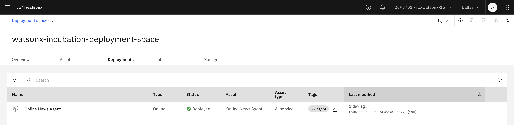
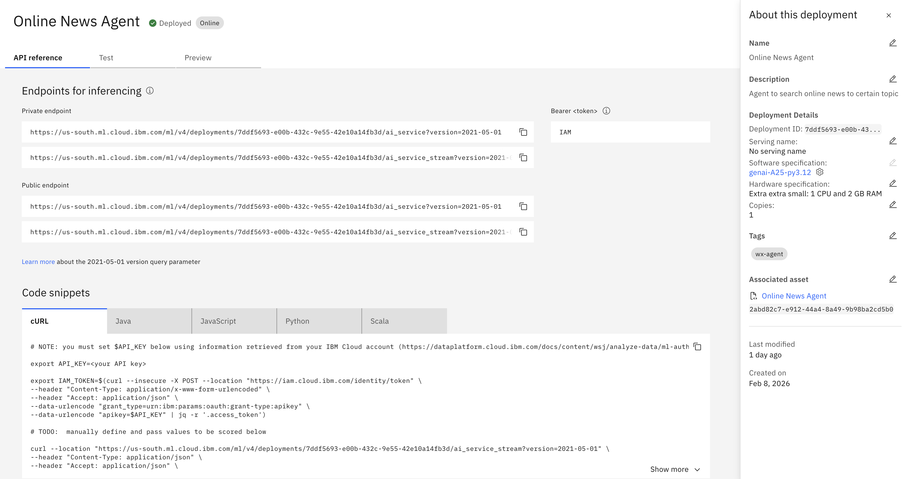
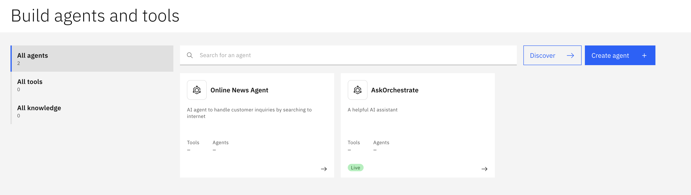
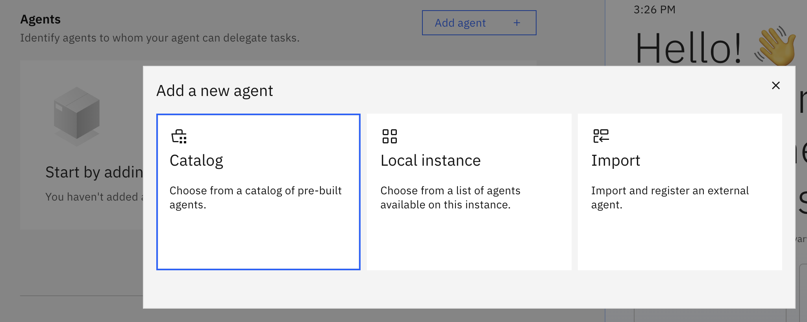
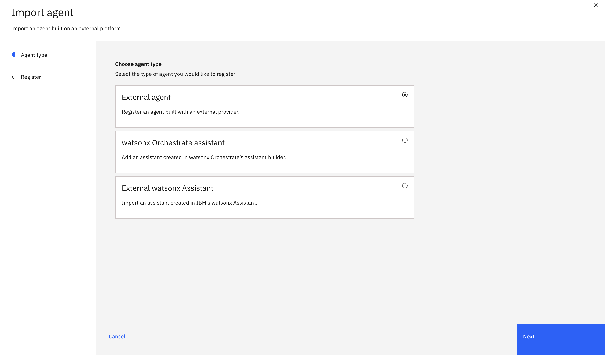
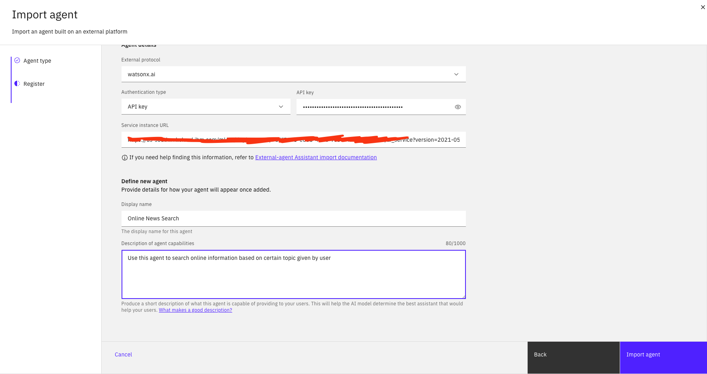
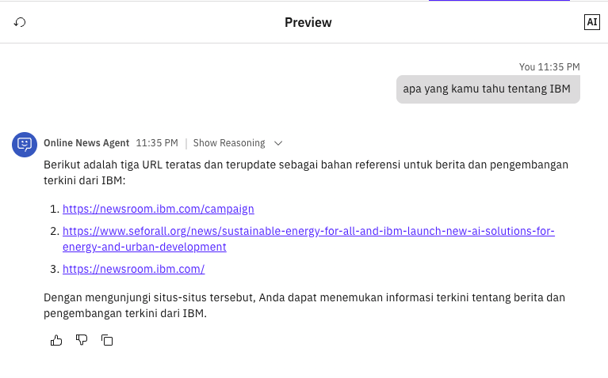

# Module 1.2: Connect to External Agent (watsonx.ai Agent)

---

## Overview

In this module, you'll learn how to extend your watsonx Orchestrate agent by connecting it to external agents, specifically the watsonx.ai agent you created in Lab 1. This enables powerful agent-to-agent communication and allows you to leverage specialized AI capabilities.

**Duration:** ~45 minutes

**Learning Objectives:**
- Integrate watsonx Orchestrate with watsonx.ai agents
- Connect to custom APIs and tools
- Implement agent-to-agent communication
- Test and validate the integration
- Handle responses from external agents

---

## Prerequisites

Before starting this module, ensure you have:
- ✅ Completed **Module 1.1: Creating Basic Agent**
- ✅ Completed **Lab 1: Develop AI Agent in watsonx.ai**
- ✅ Deployed agent in watsonx.ai (from Lab 1)
- ✅ Access to watsonx.ai deployment space
- ✅ API credentials for watsonx.ai

---

## Architecture Overview

Understanding how watsonx Orchestrate connects to external agents:

```
┌─────────────────────────────────────────────────────┐
│         watsonx Orchestrate Agent                   │
│  ┌───────────────────────────────────────────────┐ │
│  │  User Query: "Find news about subsidies"      │ │
│  └───────────────┬───────────────────────────────┘ │
│                  │                                   │
│                  ▼                                   │
│  ┌───────────────────────────────────────────────┐ │
│  │  Orchestrate Agent Processing                 │ │
│  │  - Analyzes query                             │ │
│  │  - Determines external agent needed           │ │
│  └───────────────┬───────────────────────────────┘ │
└──────────────────┼───────────────────────────────────┘
                   │
                   │ API Call
                   ▼
┌─────────────────────────────────────────────────────┐
│         watsonx.ai Agent (External)                 │
│  ┌───────────────────────────────────────────────┐ │
│  │  Online News Agent                            │ │
│  │  - Searches Google                            │ │
│  │  - Processes results                          │ │
│  │  - Returns formatted response                 │ │
│  └───────────────┬───────────────────────────────┘ │
└──────────────────┼───────────────────────────────────┘
                   │
                   │ Response
                   ▼
┌─────────────────────────────────────────────────────┐
│         watsonx Orchestrate Agent                   │
│  ┌───────────────────────────────────────────────┐ │
│  │  Formatted Response to User                   │ │
│  │  - News title, content, URL, date             │ │
│  └───────────────────────────────────────────────┘ │
└─────────────────────────────────────────────────────┘
```

---

## Part 1: Integrate with watsonx.ai Agent

### Step 1: Retrieve watsonx.ai Agent Credentials

First, you need to get the API credentials for your deployed watsonx.ai agent from Lab 1.

#### 1.1 Access Your Deployment Space

1. Log in to **IBM Cloud**
2. Navigate to **watsonx.ai**
3. Go to your **Deployment Space** (created in Lab 0)
4. Click on **Deployments** tab



---

#### 1.2 Get Agent Endpoint Details

1. Find your deployed agent: **"Online News Agent"** (from Lab 1)
2. Click on the agent name
3. Go to **API Reference** tab
4. Copy the following information:
   - **Endpoint URL**: `https://us-south.ml.cloud.ibm.com/ml/v1/deployments/{deployment_id}/predictions`



---

#### 1.3 Get API Key

Get API Key that can be retrieved after completing  in Lab 0

⚠️ **Important:** Store your API key securely. Never share it or commit it to version control.

---

### Step 2: Configure External Agent Connection in watsonx Orchestrate

Now, let's connect your Orchestrate agent to the watsonx.ai agent.

#### 2.1 Access Your Orchestrate Agent

1. Go to **watsonx Orchestrate**
2. Open the **Online News Agent** you created in Module 1.1
3. Click **Edit** to modify the agent



---

#### 2.2 Add External Agent Integration

1. In the agent editor, go to **Toolset** or **Agents** section
2. Click **Add Agent**
3. Click **Import**



---

#### 2.3 Configure watsonx.ai Agent Connection

1. Select **External Agent** and click **Next**



2. Fill the information required

**External Protocol:** `watsonx.ai`

**Authentication Type:** `<Your API Key>`

**Service Instance URL:** `<Your watsonx.ai deployment public endpoint with AI Service>`

**Display Name:** `Online News Search`

**Description of agent capabilities:** `Use this agent to search online information based on certain topic given by user`

Click **Import Agent**



---

### Step 3: Test External Agent

From Preview interface, type `Apa yang kamu tahu tentang IBM?` and see the response from the agent.



---

## Next Steps

Now that you've connected your agent to external services, you're ready to:

➡️ **[Module 1.3: Deploy Agent Anywhere](1.3-Deploy%20agent%20anywhere.md)**
- Deploy to watsonx Orchestrate interface
- Embed in web applications
- Configure public web deployment

---

## Additional Resources

- [watsonx Orchestrate Integration Guide](https://www.ibm.com/docs/en/watsonx/watson-orchestrate/current?topic=integrations)
- [watsonx.ai API Reference](https://www.ibm.com/docs/en/watsonx-as-a-service?topic=api-reference)
- [Agent-to-Agent Communication Patterns](https://www.ibm.com/docs/en/watsonx/watson-orchestrate/current?topic=agents-communication)
- [API Security Best Practices](https://www.ibm.com/docs/en/watsonx/watson-orchestrate/current?topic=security-api)

---

**Module 1.2 Complete!** 🎉

You've successfully integrated your Orchestrate agent with external agents and APIs. Continue to Module 1.3 to learn about deployment options.

---

[← Back to Module 1.1](1.1-Creating%20basic%20agent.md) | [Lab 2 Overview](README.md) | [Next: Module 1.3 →](1.3-Deploy%20agent%20anywhere.md)