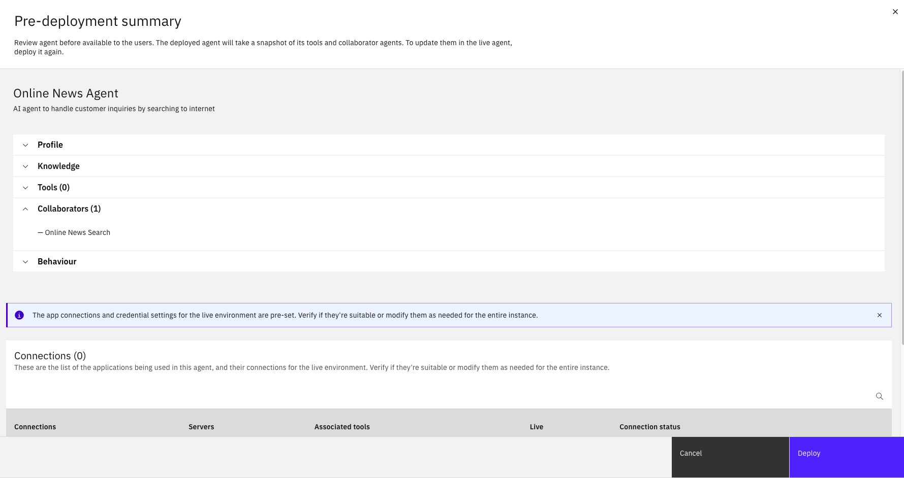
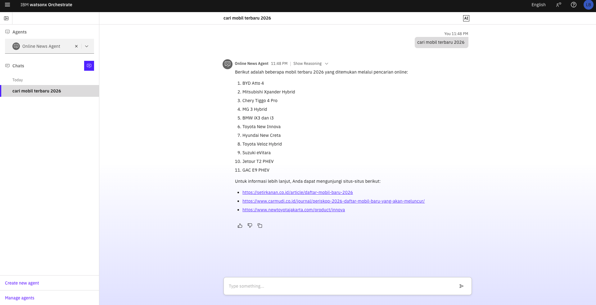
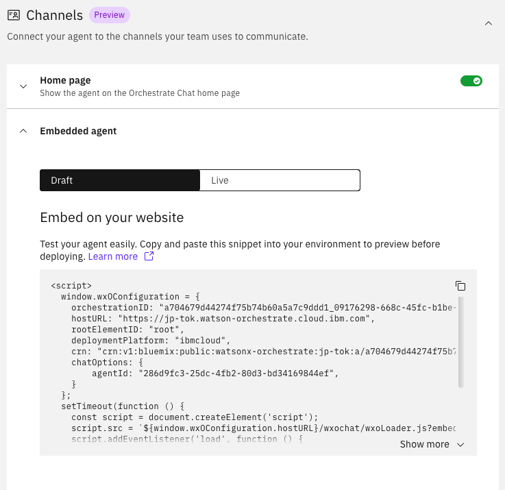

# Module 1.3: Deploy Agent Anywhere

---

## Overview

In this module, you'll learn how to deploy your watsonx Orchestrate agent to production environments and embed it into custom web applications. This enables your agent to be accessible to end users through various channels.

**Learning Objectives:**
- Deploy agent to live/production environment
- Embed agent in custom web applications
- Configure deployment settings and security
- Test deployed agent functionality
- Monitor agent performance in production

---

## Prerequisites

Before starting this module, ensure you have:
- ✅ Completed **Module 1.1: Creating Basic Agent**
- ✅ Completed **Module 1.2: Connect to External Agent**
- ✅ Tested agent functionality in preview mode
- ✅ Access to watsonx Orchestrate deployment permissions
- ✅ Basic knowledge of HTML/JavaScript (for web embedding)

---

## Deployment Architecture

Understanding the deployment options:

```
┌─────────────────────────────────────────────────────────┐
│              watsonx Orchestrate Agent                  │
│                                                         │
└────────────────────┬────────────────────────────────────┘
                     │
                     │ Deploy
                     ▼
        ┌────────────────────────────┐
        │   Deployment Options       │
        └────────────┬───────────────┘
                     │
        ┌────────────┼───────----─────┐
        │            │                │
        ▼            ▼                ▼
┌──────────────-┐ ┌──────────-----┐ ┌─────────────────┐
│ Draft Env     │ │ Live End      │ │ Custom Website  │
│ (Orchestrate) │ │ (Orchestrate))│ │ (Embedded)      │
└──────────────-┘ └──────────-----┘ └─────────────────┘
        │            │                │
        └────────────┼──────----──────┘
                     │
                     ▼
              ┌──────────────┐
              │  End Users   │
              └──────────────┘
```

---

## Part 1: Deploy Agent into Live Environment

1. Click **Deploy** button
2. Review your agent configuration. Ensure you have 1 collaborators as 'Online Search News'
3. Click **Deploy**



4. Wait until deployment process finished
5. Click Hamburger icon -> click **Chat** -> select **Online News Agent**
6. Now you are at main agent page. You can start interacting with your live agent.



---

## Part 2: Embed Agent into Your Customized Web

1. Go back to your agent configuration page by clicking Hamburger icon -> click **Build** -> select **Online News Agent**
2. Scroll down to **Channels** section -> expand **Embedded agent**
3. From there you can copy the embed code and paste it into your website.



---

## Part 3: See live agent in your website (Optional)

### Step 3.1: Install node.js

This project uses a simple local HTTP server to serve `index.html` via `npm run`.

#### Prerequisites

- Node.js (v16+ recommended)
- npm

Check installation:

```bash
node -v
npm -v
```

#### Project Structure

```
project-folder/
├── index.html
├── package.json
└── README.md
```

---

### Step 3.2: Copy Embed Code

Copy the generated embed code:

**Basic Embed Code:**

```html
<!-- watsonx Orchestrate Web Chat Widget -->
<script>
  window.wxOConfiguration = {
    orchestrationID: "your-orchestration-id",
    hostURL: "your-host-url",
    rootElementID: "root",
    deploymentPlatform: "ibmcloud",
    crn: "your-crn",
    chatOptions: {
        agentId: "your-agent", 
    }
  };
  setTimeout(function () {
    const script = document.createElement('script');
    script.src = `${window.wxOConfiguration.hostURL}/wxochat/wxoLoader.js?embed=true`;
    script.addEventListener('load', function () {
        wxoLoader.init();
    });
    document.head.appendChild(script);
  }, 0);                     
</script>

```


### Step 3.3: Create Custom Web Page 

Create a new HTML file for your custom website:

**File:** `index.html`

```html
<!DOCTYPE html>
<html lang="en">
<head>
    <meta charset="UTF-8">
    <meta name="viewport" content="width=device-width, initial-scale=1.0">
    <title>Customer Support - Your Company</title>
    <style>
        * {
            margin: 0;
            padding: 0;
            box-sizing: border-box;
        }
        
        body {
            font-family: 'IBM Plex Sans', -apple-system, BlinkMacSystemFont, 'Segoe UI', sans-serif;
            background: linear-gradient(135deg, #667eea 0%, #764ba2 100%);
            min-height: 100vh;
            display: flex;
            align-items: center;
            justify-content: center;
        }
        
        .container {
            max-width: 1200px;
            margin: 0 auto;
            padding: 40px 20px;
        }
        
        .hero {
            background: white;
            border-radius: 20px;
            padding: 60px;
            box-shadow: 0 20px 60px rgba(0, 0, 0, 0.3);
            text-align: center;
        }
        
        h1 {
            font-size: 3rem;
            color: #333;
            margin-bottom: 20px;
        }
        
        p {
            font-size: 1.2rem;
            color: #666;
            margin-bottom: 30px;
            line-height: 1.6;
        }
        
        .cta-button {
            display: inline-block;
            padding: 15px 40px;
            background: #0f62fe;
            color: white;
            text-decoration: none;
            border-radius: 8px;
            font-size: 1.1rem;
            font-weight: 600;
            transition: all 0.3s ease;
            cursor: pointer;
            border: none;
        }
        
        .cta-button:hover {
            background: #0353e9;
            transform: translateY(-2px);
            box-shadow: 0 10px 20px rgba(15, 98, 254, 0.3);
        }
        
        .features {
            display: grid;
            grid-template-columns: repeat(auto-fit, minmax(250px, 1fr));
            gap: 30px;
            margin-top: 50px;
        }
        
        .feature {
            background: #f4f4f4;
            padding: 30px;
            border-radius: 12px;
            text-align: left;
        }
        
        .feature h3 {
            color: #0f62fe;
            margin-bottom: 10px;
            font-size: 1.3rem;
        }
        
        .feature p {
            font-size: 1rem;
            margin-bottom: 0;
        }
        
        .chat-info {
            margin-top: 40px;
            padding: 20px;
            background: #e8f4ff;
            border-radius: 12px;
            border-left: 4px solid #0f62fe;
        }
        
        .chat-info h3 {
            color: #0f62fe;
            margin-bottom: 10px;
        }
    </style>
</head>
<body>
    <div class="container">
        <div class="hero">
            <h1>🤖 Welcome to Customer Support</h1>
            <p>
                Get instant help with our AI-powered customer support agent. 
                Available 24/7 to answer your questions and assist with your needs.
            </p>
            
            <div class="features">
                <div class="feature">
                    <h3>⚡ Instant Responses</h3>
                    <p>Get immediate answers to your questions without waiting in queue.</p>
                </div>
                <div class="feature">
                    <h3>🌐 Latest News</h3>
                    <p>Search for the latest news and information on any topic.</p>
                </div>
                <div class="feature">
                    <h3>🔒 Secure & Private</h3>
                    <p>Your conversations are encrypted and handled securely.</p>
                </div>
                <div class="feature">
                    <h3>🎯 Smart Assistance</h3>
                    <p>AI-powered agent understands context and provides relevant help.</p>
                </div>
            </div>
            
            <div class="chat-info">
                <h3>💡 How to Use</h3>
                <p>
                    Click the chat button in the bottom-right corner or use the "Start Chat Now" button above. 
                    Our AI agent can help you with:
                </p>
                <ul style="text-align: left; margin-top: 10px; padding-left: 20px;">
                    <li>Finding latest news and information</li>
                    <li>Answering frequently asked questions</li>
                    <li>Providing business hours and contact details</li>
                    <li>Handling product inquiries and support</li>
                </ul>
            </div>
        </div>
    </div>

    <!-- watsonx Orchestrate Web Chat Widget -->
    <script>
        window.wxOConfiguration = {
            orchestrationID: "your-orchestration-id",
            hostURL: "your-host-url",
            rootElementID: "root",
            deploymentPlatform: "ibmcloud",
            crn: "your-crn",
            chatOptions: {
                agentId: "your-agent", 
            }
        };
        setTimeout(function () {
            const script = document.createElement('script');
            script.src = `${window.wxOConfiguration.hostURL}/wxochat/wxoLoader.js?embed=true`;
            script.addEventListener('load', function () {
                wxoLoader.init();
            });
            document.head.appendChild(script);
        }, 0);                     
    </script>
</body>
</html>
```


### Step 3.4: Test the Web Page

1. Initialize npm (if not already done)

```npm init -y```

2. Install simple http server

```npm install --save-dev http-server```

3. Update `package.json` to include a start script

```
{
  "scripts": {
    "start": "http-server . -p 3000"
  }
}
```

4. Run the application

```
npm run start
```

Open your browser and visit: http://localhost:3000


---

## Summary

In this module, you learned how to:

✅ **Deploy Agent to Live Environment**
- Prepared agent for production
- Configured deployment settings
- Deployed to live environment
- Verified deployment success
- Monitored initial performance

✅ **Embed Agent in Custom Web**
- Got embed code from watsonx Orchestrate
- Created custom HTML page
- Customized widget appearance
- Added advanced features
- Tested across browsers and devices
- Deployed to production website
- Set up monitoring and analytics

---

## Next Steps

Congratulations! You've completed Lab 2. You now have:
- ✅ A fully functional conversational agent
- ✅ Integration with external agents (watsonx.ai)
- ✅ Production deployment
- ✅ Custom web embedding

**Continue Learning:**

➡️ **[Lab 3: Develop Agentic AI using Agent Development Kit (ADK)](../Lab%203-Develop%20Agentic%20AI%20using%20Agent%20Development%20Kit%20(ADK)/README.md)**
- Learn advanced agent development
- Build custom tools and integrations
- Implement complex workflows

---

## Additional Resources

- [watsonx Orchestrate Deployment Guide](https://www.ibm.com/docs/en/watsonx/watson-orchestrate/current?topic=deployment)
- [Web Chat Widget Documentation](https://www.ibm.com/docs/en/watsonx/watson-orchestrate/current?topic=web-chat-widget)
- [Embedding Best Practices](https://www.ibm.com/docs/en/watsonx/watson-orchestrate/current?topic=embedding-best-practices)
- [Production Deployment Checklist](https://www.ibm.com/docs/en/watsonx/watson-orchestrate/current?topic=production-checklist)

---

**Module 1.3 Complete!** 🎉

You've successfully deployed your agent to production and embedded it in a custom website. Your agent is now live and ready to serve users!

---

[← Back to Module 1.2](1.2-Connect%20to%20external%20agent%20(watsonx.ai%20Agent).md) | [Lab 2 Overview](README.md) | [Next: Lab 3 →](../Lab%203-Develop%20Agentic%20AI%20using%20Agent%20Development%20Kit%20(ADK)/README.md)