# Build Agentic Flow

---

## Overview

Welcome to Lab 3! In this lab, you'll learn how to build an **agentic flow** in watsonx Orchestrate that enables document upload and automatic text extraction. You'll create an intelligent workflow that extracts specific information from uploaded documents using AI-powered document extraction.

**What is an Agentic Flow?**

An agentic flow is an automated workflow that combines multiple AI capabilities to accomplish complex tasks. In this lab, you'll build a flow that:
- Accepts document uploads from users
- Extracts text and specific information from documents
- Returns structured data in a defined format

By the end of this lab, you'll have a working document extraction flow that can identify and extract promotional information from uploaded documents.

---

## Prerequisites

Before starting this lab, ensure you have:
- ✅ Completed **Lab 0: Environment Setup**
- ✅ Completed **Lab 1: Develop AI Agent in watsonx.ai**
- ✅ Completed **Lab 2: Introduction to watsonx Orchestrate**
- ✅ Access to watsonx Orchestrate instance
- ✅ Sample promotional documents for testing

---

## Learning Objectives

By completing this lab, you will:

1. **Understand Agentic Flows**
   - Learn what agentic flows are and their use cases
   - Understand flow components and architecture
   - Explore document extraction capabilities

2. **Create Document Extraction Flow**
   - Build a new agentic flow from scratch
   - Configure input and output parameters
   - Set up document extraction nodes

3. **Configure AI-Powered Extraction**
   - Define extraction fields
   - Use AI to locate information in documents
   - Validate bounding box positions

4. **Test and Deploy Flow**
   - Test the flow with sample documents
   - Validate extraction results
   - Deploy for production use

---

## User Flow

The final user experience will be:

```
1. User: "I want to upload document"
   ↓
2. Agent: Displays upload interface
   ↓
3. User: Uploads promotional document
   ↓
4. Agent: Extracts text and returns structured data
   ↓
5. User: Receives extracted information:
   - Promo Name
   - Promo Period
```

---

## Architecture Overview

```
┌─────────────────────────────────────────────────────┐
│              User Interface                         │
│  "I want to upload document"                        │
└────────────────────┬────────────────────────────────┘
                     │
                     ▼
┌─────────────────────────────────────────────────────┐
│           Agentic Flow (watsonx Orchestrate)        │
├─────────────────────────────────────────────────────┤
│                                                     │
│  ┌──────────┐    ┌──────────────────┐   ┌────────┐│
│  │  Input   │───▶│   Document       │──▶│ Output ││
│  │  Node    │    │   Extraction     │   │  Node  ││
│  │          │    │   Node           │   │        ││
│  └──────────┘    └──────────────────┘   └────────┘│
│                                                     │
│  Input:                 Process:          Output:  │
│  - document_ref         - Extract text    - JSON   │
│  (file)                 - Find fields     object   │
│                         - Validate                 │
│                                                     │
└─────────────────────────────────────────────────────┘
                     │
                     ▼
┌─────────────────────────────────────────────────────┐
│              Extracted Data                         │
│  {                                                  │
│    "promoName": "Summer Sale 2024",                 │
│    "promoPeriod": "June 1 - August 31, 2024"        │
│  }                                                  │
└─────────────────────────────────────────────────────┘
```

---

## Step-by-Step Guide

### Step 1: Create New Agentic Flow

1. Log in to **watsonx Orchestrate**
2. Click Hamburger icon and navigate to **Build**
3. Click **All tools**
4. Click **Create tool** -> select **Agenic Flow**
5. Enter flow details:
   - **Name**: `Document Extraction Flow`
6. Click Start Building

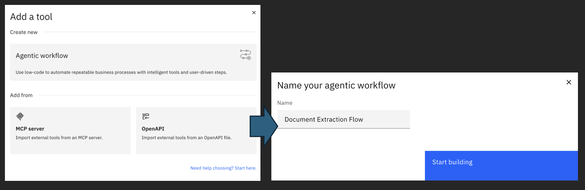

---

### Step 2: Set Up Input Parameters

Configure the input that the flow will accept:

1. In the flow editor, click on the **Input** node
2. Click **Add Input**
3. Select File
4. Configure the input:

**Field Details:**
- **Name**: `document_ref`
- **Description**: `Document to extract information from`

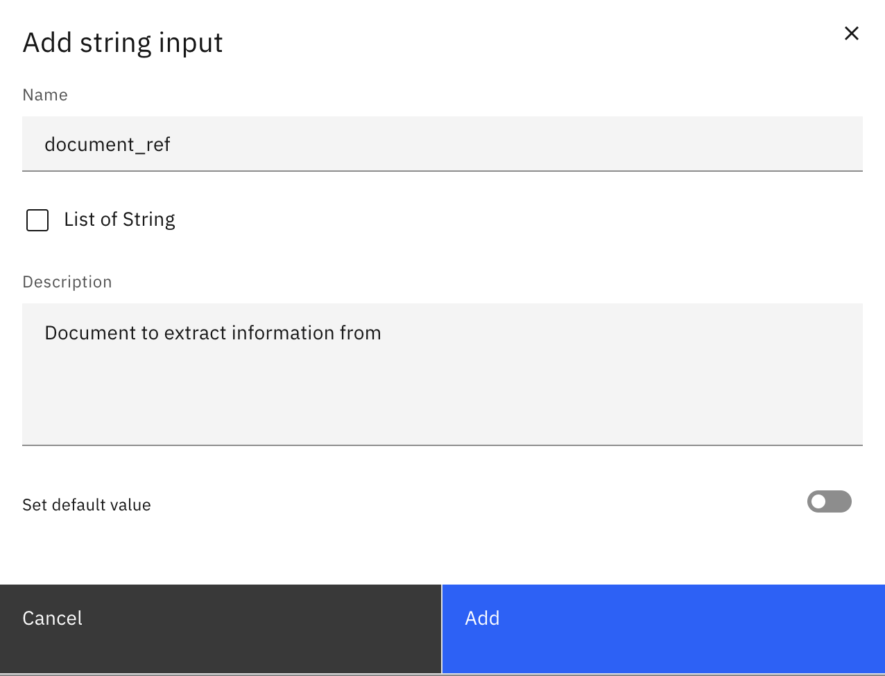

---

### Step 3: Set Up Output Parameters

Configure the output structure that the flow will return:

1. Click on the **Output** node
2. Click **Add Output**
3. Select Object
4. Go to **JSON view** tab
4. Copy and paste this JSON:

```json
{
  "text_extraction_result": {
    "type": "object",
    "description": "result of text extraction",
    "properties": {
      "promoName": {
        "type": "string",
        "description": "promo name extracted from uploaded document"
      },
      "promoPeriod": {
        "type": "string",
        "description": "period of promo extracted from uploaded document"
      }
    }
  }
}
```

5. Click Save button

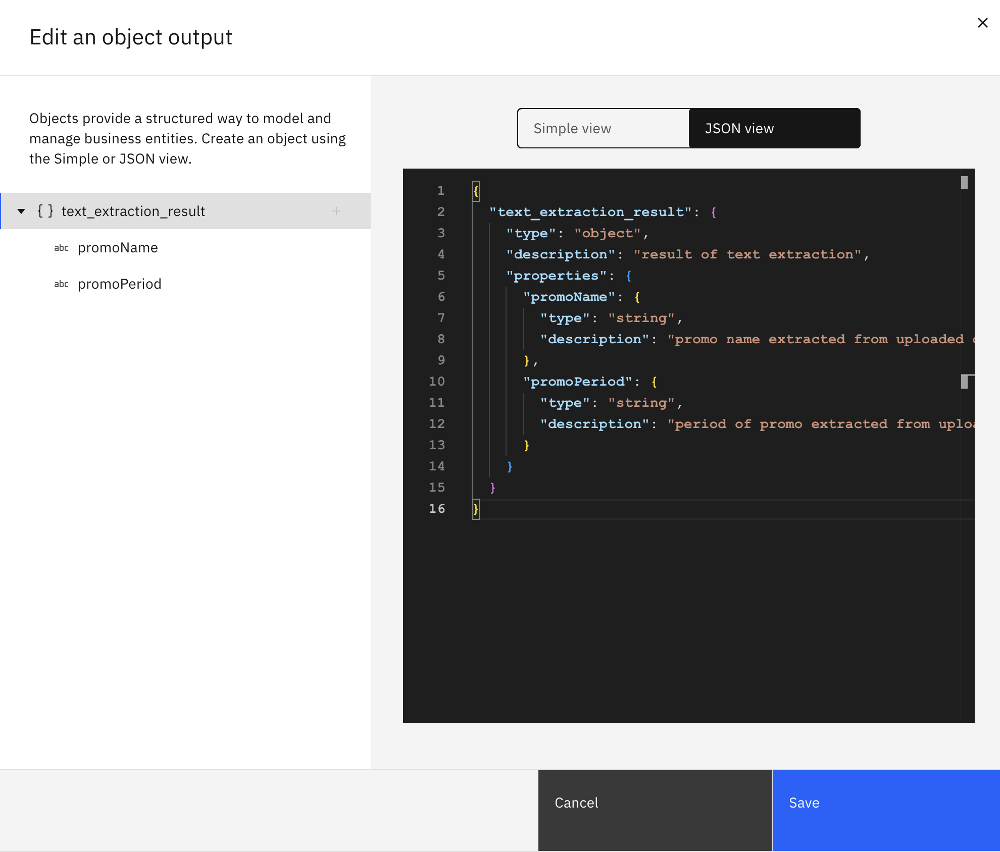

---

### Step 4: Open Flow Editor

Ensure you have same view as below:

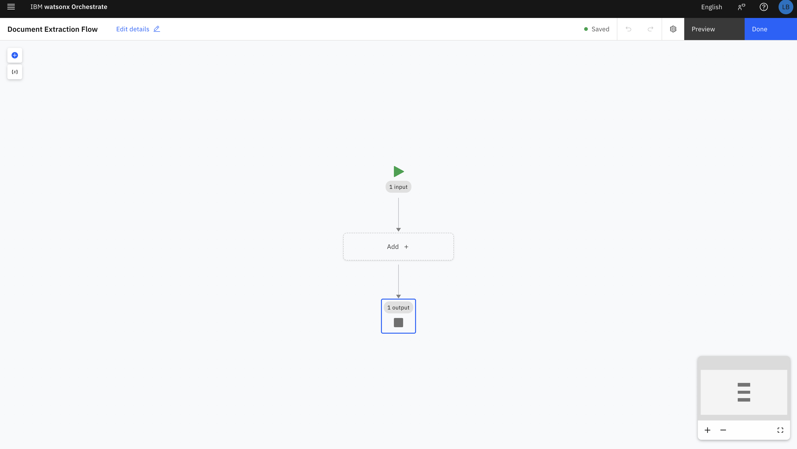

1. Click **Add +** -> select **Document extractor** node

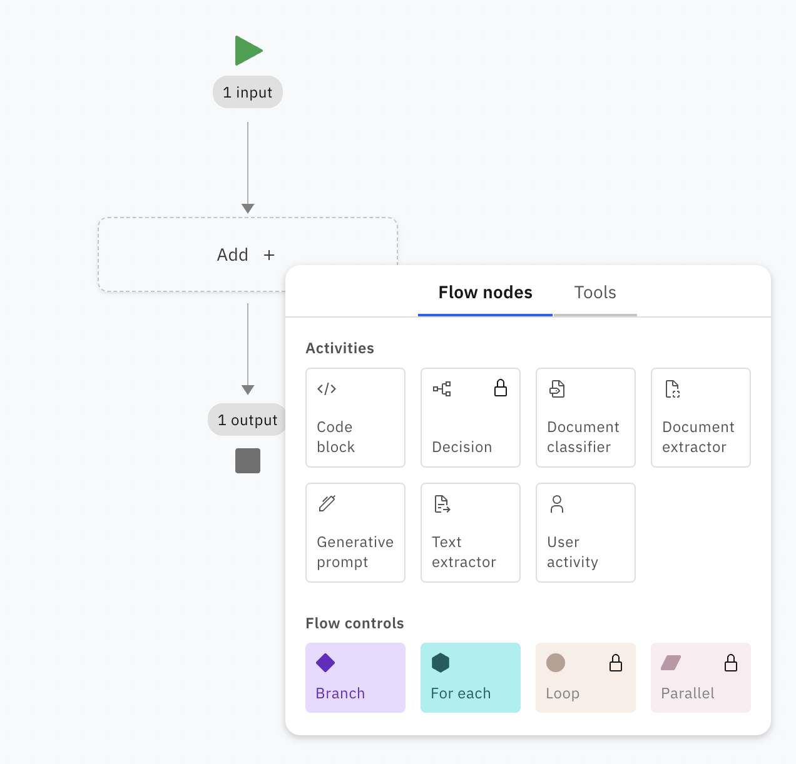

2. Select **Unstructured** then you will see **Document extractor** pane
3. Select `watsonx/ibm/granite-3-3-8b-instruct` as model
4. Download sample document [here](assets/promo_document.pdf)
5. Upload the document to the **Upload pane**
6. You'll see the preview of document. 
    - Click **Add field +** -> type `promoName` -> press Enter
    - Click **Add field +** -> type `promoPeriod` -> press Enter

You will see that watsonx Orchestrate is learning from your format document. You can close **Document extractor** pane.

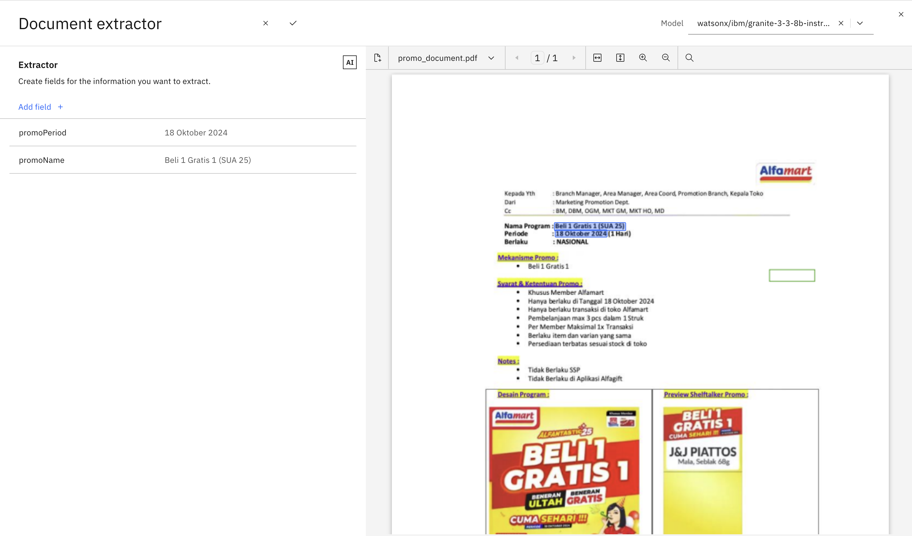

7. Click **Done** button

---

### Step 5: Create Agent to Use the Flow

Now that you've created the document extraction flow, let's create an agent that can use this flow to help users upload and extract information from documents.

#### 5.1 Access Agent Builder

1. In watsonx Orchestrate, click the **hamburger menu** (☰)
2. Navigate to **Build**
3. Click **All Agent** 

---

#### 5.2 Create New Agent

1. Fill in the agent details:
   - **Agent Name**: `Document Processing Agent`
   - **Description**: `AI agent that helps users upload documents and extract promotional information`

2. Click **Create**

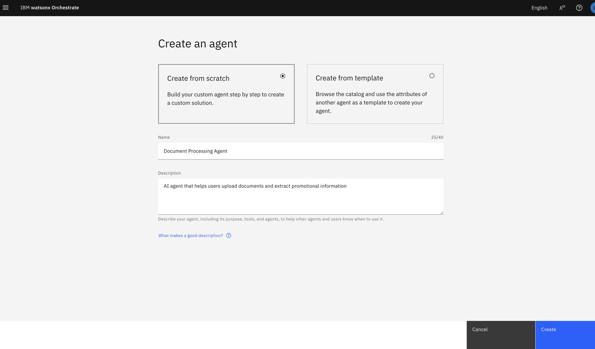

---

#### 5.3 Configure Agent Instructions

In the **Agent Instructions** section, add the following instructions to guide the agent's behavior:

```
You are a helpful document processing assistant. Your role is to:

1. Greet users warmly and professionally
2. Help users upload promotional documents
3. Extract key information from uploaded documents using the Document Extraction Flow
4. Present extracted information in a clear, user-friendly format
5. Answer questions about the extracted information
6. Offer to process additional documents if needed

When a user wants to upload a document:
- Use the Document Extraction Flow tool
- Present the upload interface clearly
- Process the document and extract promo name and promo period
- Format the results in a friendly, easy-to-read manner

Tone: Professional, friendly, and helpful
Style: Clear and concise
Language: Simple and easy to understand
```

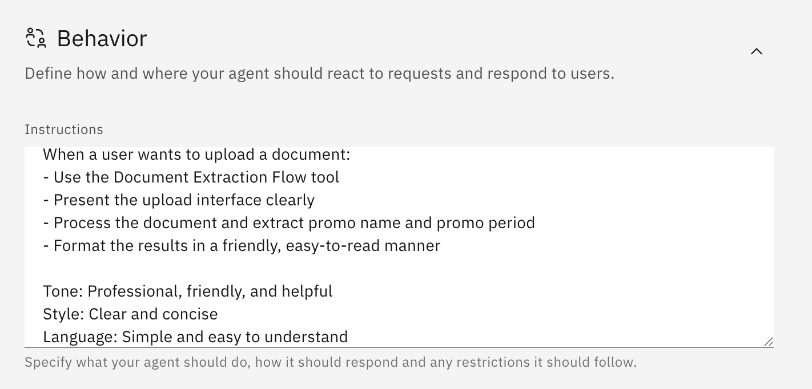

---

#### 5.4 Add Document Extraction Flow as Tool

Connect your flow to the agent:

1. In the agent editor, go to **Tools** section
2. Click **Add Tool** -> select **Local instance**
3. Search for `Document Extraction Flow`
4. Select your flow from the list
5. Click **Add** or **Confirm**

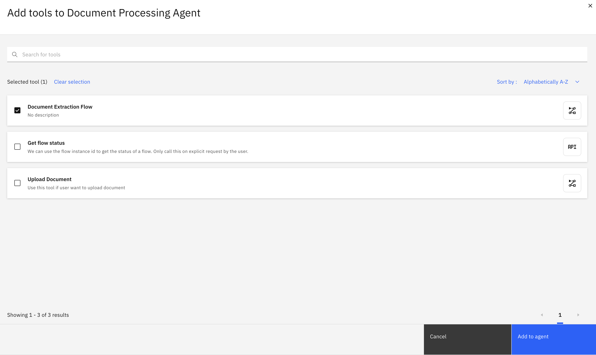

6. Redo previous steps to add `Get flow status` flow

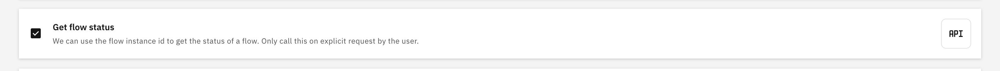

---

#### 5.5 Test the Agent

1. In **Agent Preview** start a test conversation

**Test Conversation Example:**

```
I want to upload document
```

2. Upload file that you have downloaded before

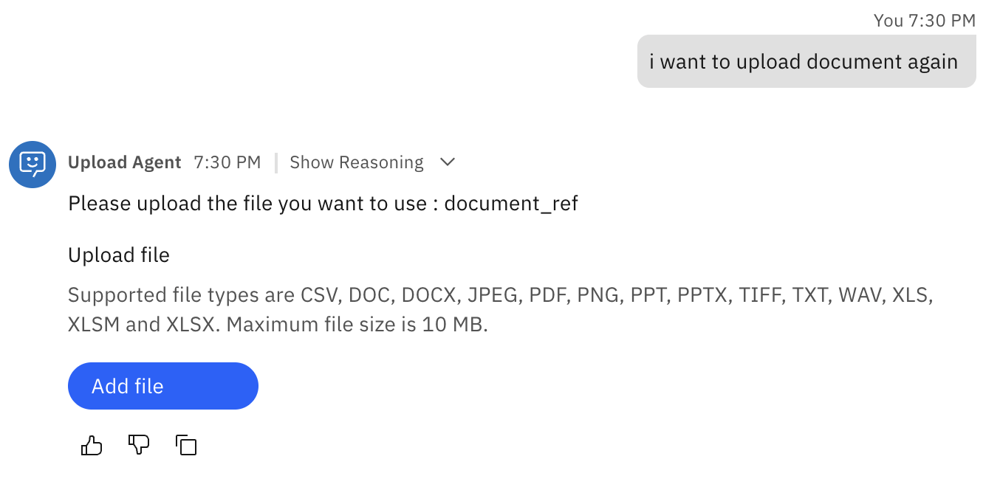

3. Press **Enter**
4. Wait until flow is completed then you will get the extraction result

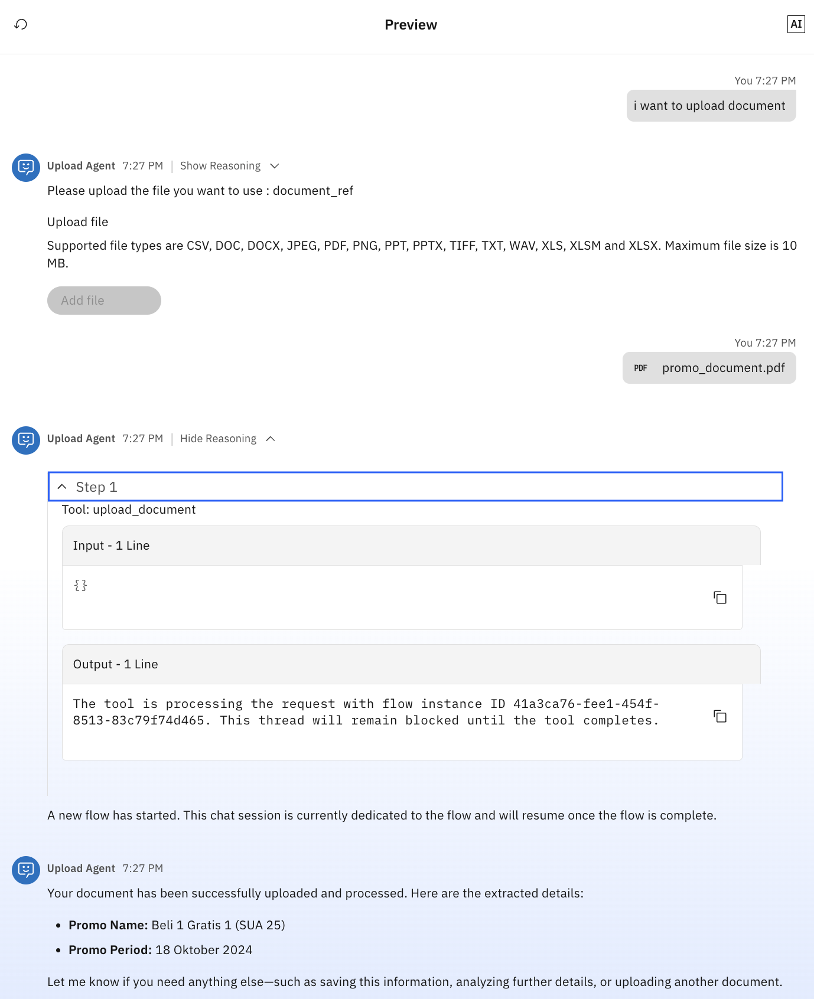

5. You can also see the output of flow by typing `Get flow status` in the chat and type `flow id` that you get from previous step

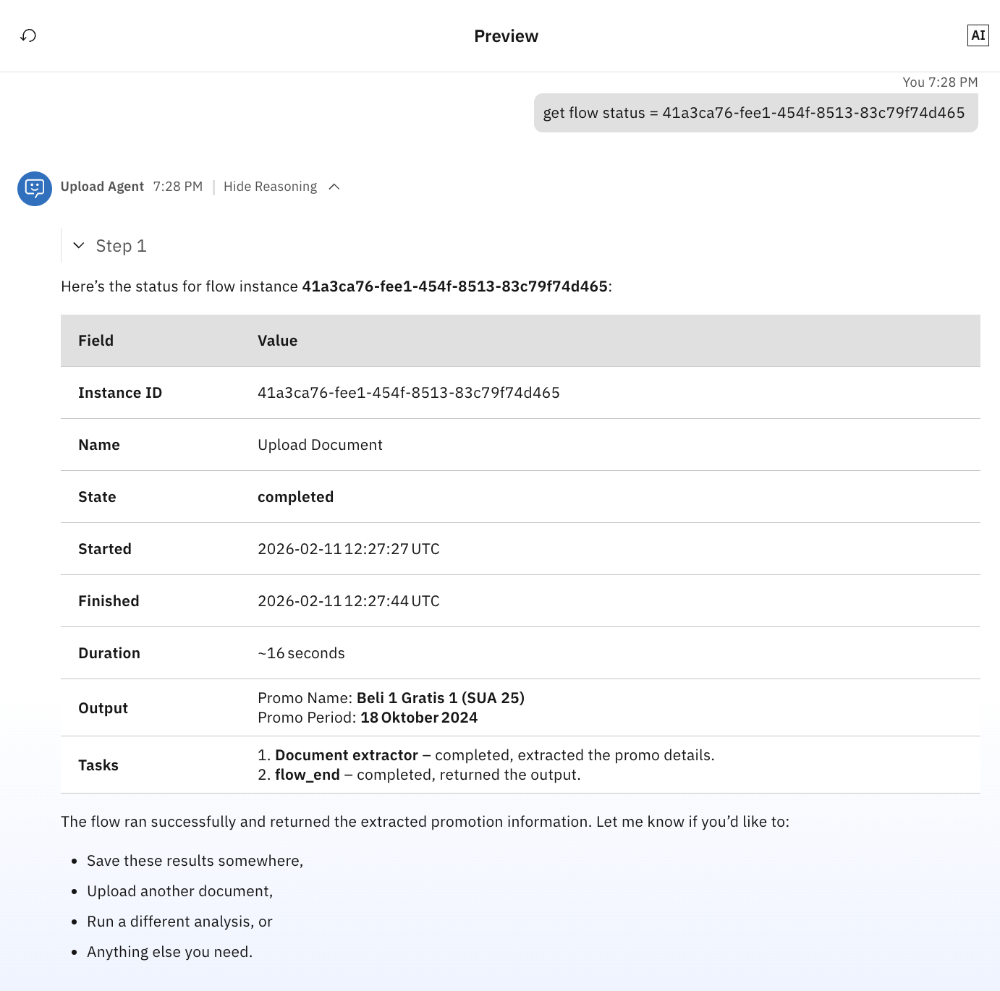

---

## Next Steps

Now that you've built an agentic flow and integrated it with an agent, you're ready to:

➡️ **[Lab 4: Develop Agentic AI using Agent Development Kit (ADK)](../Lab%204-Develop%20Agentic%20AI%20using%20Agent%20Development%20Kit%20(ADK)/README.md)**
- Learn to build agents and flows programmatically
- Create custom tools with Python
- Implement advanced workflows with code
- Automate deployment processes

---

## Additional Resources

### Documentation
- [watsonx Orchestrate Flows Documentation](https://www.ibm.com/docs/en/watsonx/watson-orchestrate/current?topic=flows)
- [Document Extraction Guide](https://www.ibm.com/docs/en/watsonx/watson-orchestrate/current?topic=extraction-document)
- [Agent Builder Documentation](https://www.ibm.com/docs/en/watsonx/watson-orchestrate/current?topic=agents-building)
- [Agentic Flow Best Practices](https://www.ibm.com/docs/en/watsonx/watson-orchestrate/current?topic=flows-best-practices)

### Tutorials
- [Building Your First Flow](https://www.ibm.com/docs/en/watsonx/watson-orchestrate/current?topic=flows-first-flow)
- [Advanced Document Extraction](https://www.ibm.com/docs/en/watsonx/watson-orchestrate/current?topic=extraction-advanced)
- [Agent-Flow Integration](https://www.ibm.com/docs/en/watsonx/watson-orchestrate/current?topic=integration-agent-flow)

### Community
- [IBM watsonx Community](https://community.ibm.com/community/user/watsonx/home)
- [watsonx Orchestrate Forum](https://community.ibm.com/community/user/watsonx/communities/community-home?CommunityKey=watsonx-orchestrate)

---

## Use Cases

This document extraction solution can be extended for various use cases:

### Marketing & Sales
- Extract promotional campaign details
- Process marketing materials
- Analyze competitor promotions
- Track campaign periods and offers

### Finance
- Extract invoice information
- Process receipts and expense reports
- Analyze financial documents
- Extract payment terms and amounts

### HR
- Extract resume information
- Process application forms
- Analyze employee documents
- Extract candidate qualifications

### Legal
- Extract contract details
- Process legal documents
- Analyze compliance documents
- Extract key terms and dates

### Retail
- Process product catalogs
- Extract pricing information
- Analyze promotional materials
- Track seasonal campaigns

---

[← Back to Lab 2](../Lab%202-Introduction%20to%20watsonx%20Orchestrate/README.md) | [Next: Lab 4 →](../Lab%204-Develop%20Agentic%20AI%20using%20Agent%20Development%20Kit%20(ADK)/README.md)
