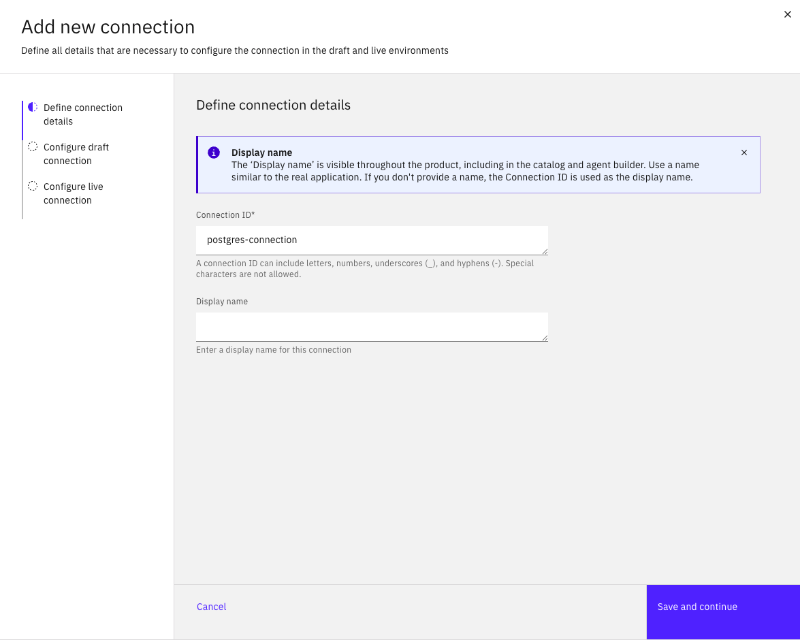
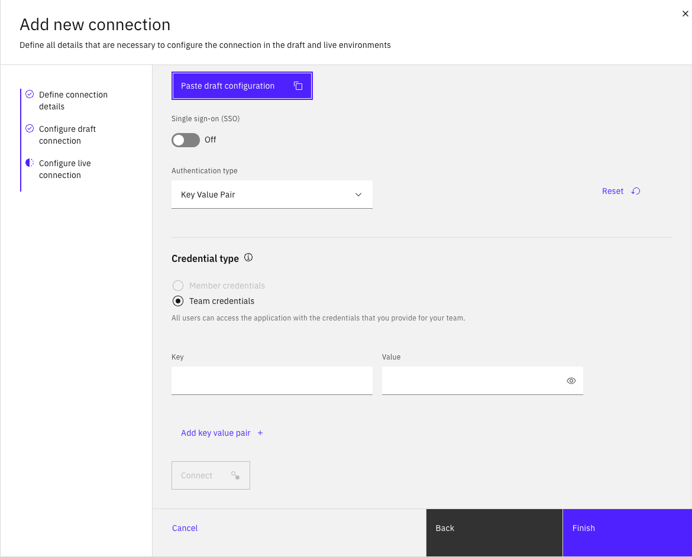

# Module 2.1: Creating Connection

---

## Overview

In this module, you'll learn how to create and manage connections in watsonx Orchestrate using the user interface. Connections are essential for integrating your agents with external services, APIs, and data sources. This is a prerequisite for using the Agent Development Kit (ADK) effectively.

**Duration:** ~20 minutes

**Learning Objectives:**
- Understand connection types in watsonx Orchestrate
- Create connections using the UI
- Configure authentication and credentials
- Test and validate connections
- Manage connection lifecycle

---

## Prerequisites

Before starting this module, ensure you have:
- ✅ Access to watsonx Orchestrate instance
- ✅ Admin or developer permissions
- ✅ API credentials for services you want to connect
- ✅ Completed Lab 0, Lab 1, and Lab 2

---

## What are Connections?

**Connections** in watsonx Orchestrate are configured integrations that allow your agents to:
- Access external APIs and services
- Authenticate with third-party systems
- Retrieve and send data securely
- Integrate with enterprise applications

---

## Part 1: Access Connection Management

1. Log in to **watsonx Orchestrate**
2. Click on the **hamburger menu** (☰) in the top-left corner
3. Select **Manage** -> **Connections**
4. You'll see the Connections dashboard


---

## Part 2: Create a New Connection

### Step 2: Start Creating Connection

1. Click **Add New Connection** button
2. You'll see the connection creation wizard
3. Fill Connection ID with ```postgres-connection```
4. Click **Save and continue** button



5. Click **Confirm** when you are asked to confirm on creating connection

---

### Step 3: Configure Connection

1. Select the type of authentication you want to create. Select ```Key Value Pair```
2. Scroll down then add 4 key value pairs as below:
- Key: ```POSTGRES_USER```, Value: ```postgres```
- Key: ```POSTGRES_PASSWORD```, Value: ```postgres```
- Key: ```POSTGRES_DB```, Value: ```watsonxdb```
- Key: ```POSTGRES_HOST```, Value: ```Ask your instructor to get host ip address```
3. Click **Connect**
4. Click **Next**


5. Click **Paste draft configuration**
6. Click **Finish**



7. Ensure your connection is visible


---

## Next Steps

Now that you've created connections, you're ready to:

➡️ **[Module 2.2: Install ADK](2.2-Install%20ADK.md)**
- Install Agent Development Kit
- Set up development environment
- Configure ADK to use your connections

---

## Additional Resources

- [watsonx Orchestrate Connections Documentation](https://www.ibm.com/docs/en/watsonx/watson-orchestrate/current?topic=connections)
- [Authentication Best Practices](https://www.ibm.com/docs/en/watsonx/watson-orchestrate/current?topic=security-authentication)
- [API Connection Guide](https://www.ibm.com/docs/en/watsonx/watson-orchestrate/current?topic=connections-api)
- [Troubleshooting Connections](https://www.ibm.com/docs/en/watsonx/watson-orchestrate/current?topic=troubleshooting-connections)

---

**Module 2.1 Complete!** 🎉

You've successfully learned how to create and manage connections in watsonx Orchestrate. These connections will be essential for the ADK modules ahead.

---

[← Back to Lab 3 Overview](README.md) | [Next: Module 2.2 →](2.2-Install%20ADK.md)